# 🤍Val'kyr Twins Special Ability order🖤

 _Discord_: `Discfordge` [_Vivax (Pagle-US)_]  
 _Discord_: `cat_nip` 

> Is the sequence of special abilities for the Val'Kyr Twins "random"?

The following document describes the unequal probability of "Val'Kyr Twins" special ability cast order in their Classic version of World of Warcraft: Wrath of the Lich King (2023) - Phase 3.

There is a pattern on their sequence, but we say it is "random" because we can't establish a causal (?) relationship.

> Why would they not be random anyways?

[Click here to jump to the result or keep reading](https://github.com/ForgeGit/TwinValks#results) `¯\_(ツ)_/¯`

## Introduction

The Val'kyr Twins are the 4th Boss encounter within the raid of the Trial of the Crusader (ToC). 

Throughout this encounter, one (1) of the following four (4) abilities is cast every 45 seconds:

- [Shield of Darkness (SoD)](https://www.wowhead.com/wotlk/spell=65874/shield-of-darkness)
- [Dark Vortex (DV)](https://www.wowhead.com/wotlk/spell=66058/dark-vortex#comments)
- [Shield of Lights (SoL)](https://www.wowhead.com/wotlk/spell=65858/shield-of-lights)
- [Light Vortex (LV)](https://www.wowhead.com/wotlk/spell=66046/light-vortex#comments)

The four (4) abilities are cycled through before repeating.

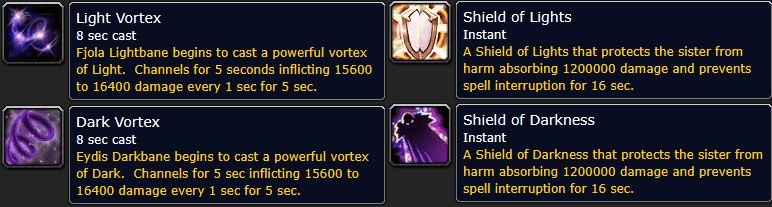  

## Background

On September 6, 2023, `cat_nip` (Discord User) conducted an [exploratory analysis](https://discord.com/channels/253212375790911489/954035835249000509/1148965319256309790) into the distribution of these abilities. 

His findings suggested that there is a distinct bias towards certain abilities, specifically Shield of Darkness (SoD), which was the most frequently observed initial ability cast. 

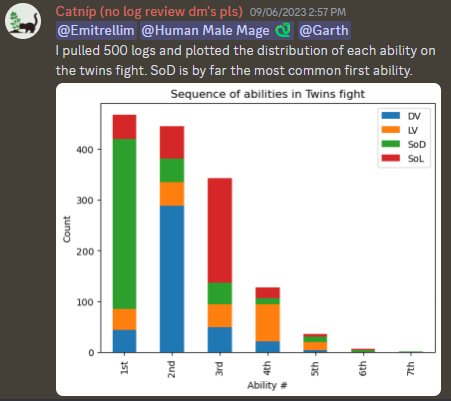  

Despite the use of a sampling method that should have guaranteed some degree of independence on each sample, the analysis was met with skepticism due to its sample size, lack of stratification, and lack of causal explanation. 

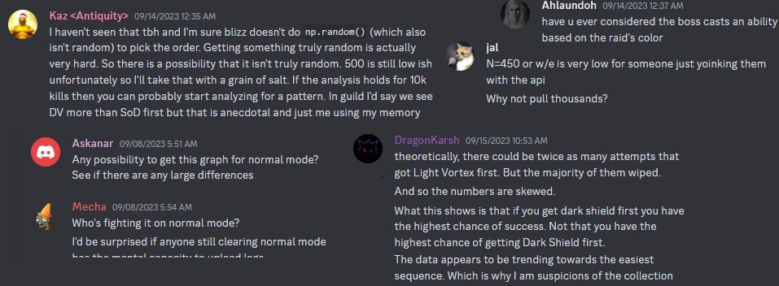  

Let's fix that.

## Results

Using 6,704 Val'kyr Twins encounters (wipes and kills) we can explore the patterns of the boss.

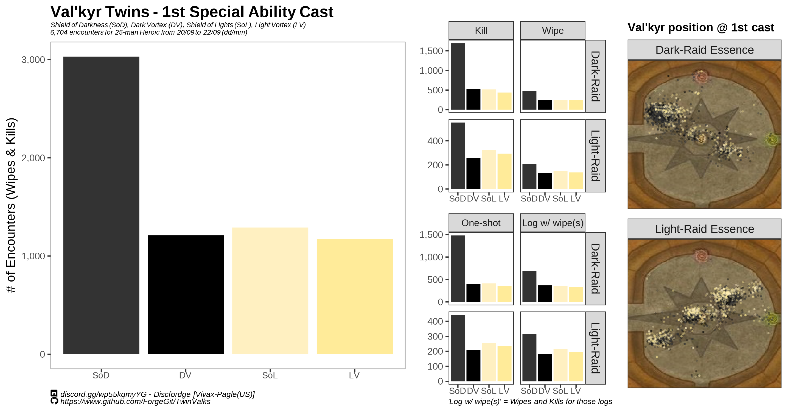  

The boss seems to consistently cast Shield of Darkness (SoD) more than the other 3 abilities, and this pattern cannot be explained by raid essence (Dark/Light), position of the raid (left/right, front/back) or whether the encounter was a wipe or a kill.

## Extra results

% HP of the boss at time of casting (45s) did not show any significant relationship either.  

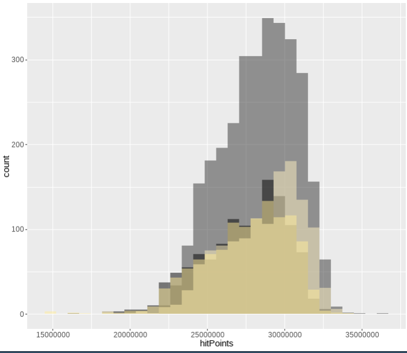  

These statistics were also explored for different samples from Execution and Speed rankings (top 2,500).

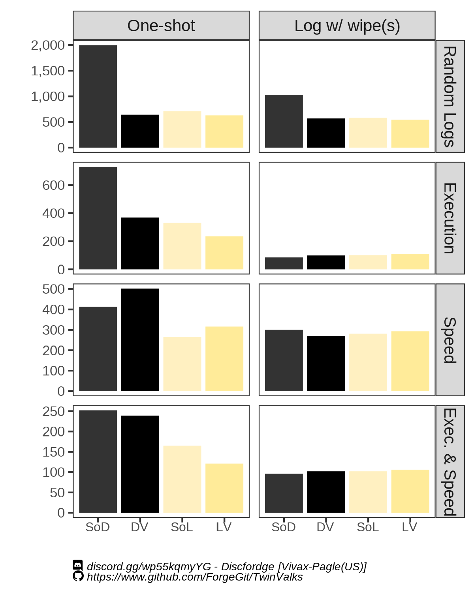  

Slightly unsurprising, Speed rankings show bias in its results, with both DV and SoD being higher than SoL and LV. 

This can be explained in part by logs that are uploaded intentionally omitting the # of wipes, and by the fact that logs in the top speed should be biased towards SoL and DV. 

Notably however, SoD remained high and it is consistent in Execution ranked logs.

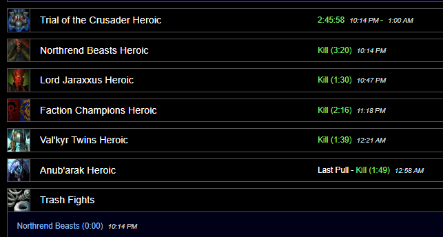  
*3 hours ToC without wipes? Believable I guess*

Raid positioning at the moment of cast (45s) was also explored.

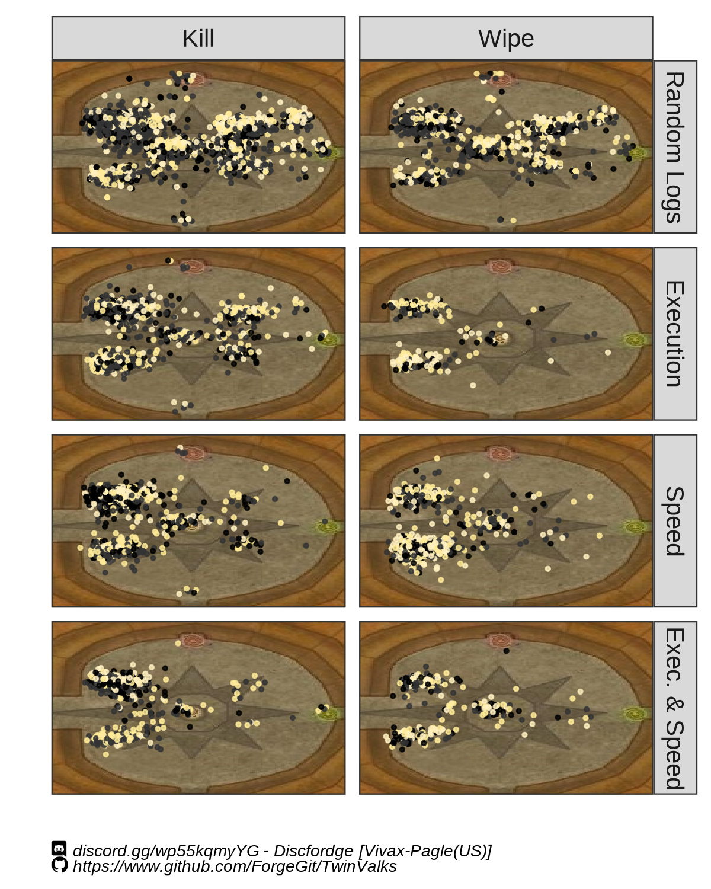  

Funny to think TW/KR regions have been pulling with Light Essence all along. 

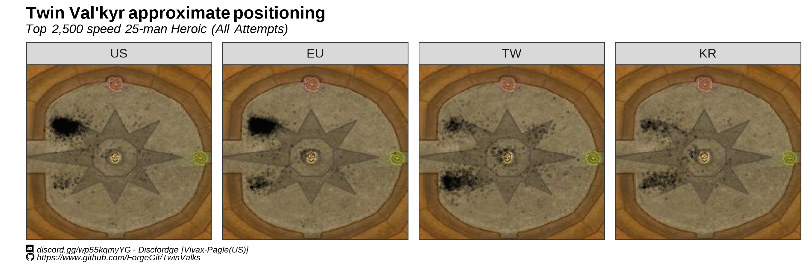  
*Is the West wrong? Do they know something we don't?*

Honestly there isn't much more to show but this one looks nice (and i couldn't fit it anywhere else)

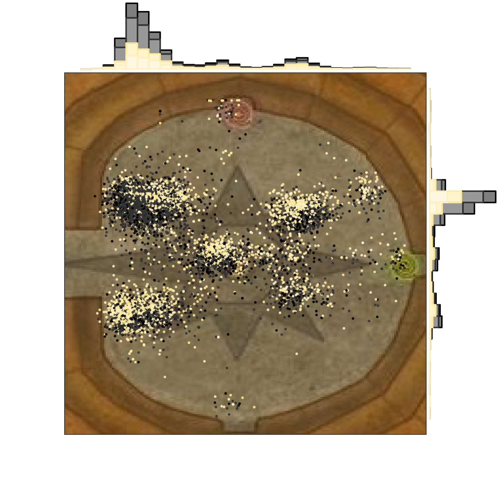  

When looking at the distribution of sequences up to the 4th ability, we see that the sequence SoD -> DV -> SoL -> LV is heavily favored. The following diagram shows the distribution of abilities for the 1st to 4th and the connections show the sequence flow. The size of each node and connection denotes the ratio of occurrences in the dataset. To avoid survivorship bias as much as possible, only the first pull of each log was taken into account.
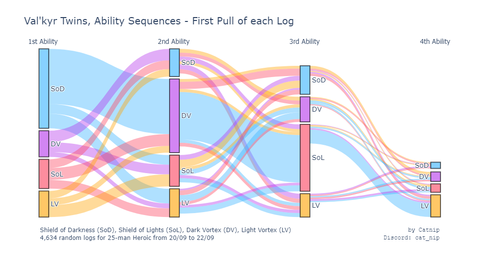  

As expected, the sequence flow for wipes only shows a much higher number of the less likely sequences, probably throwing raids off:
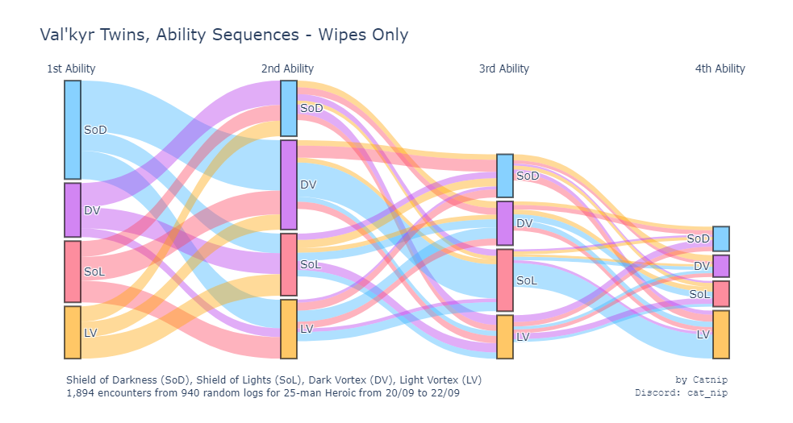  

## Methodology

All the data was collected using the [Warcraft Logs Classic API v2](https://articles.classic.warcraftlogs.com/help/api-documentation) and processed with R v.4.2 (R Development Core Team).

Trial of the Crusader (ToC) raids were located in this zone: https://classic.warcraftlogs.com/zone/reports?zone=1018

Duplicated encounters were excluded based on: "Encounter Name", "Difficulty", "Size", "Kill/Wipe", "Boss %", "Fight Length", and "Avg. ilvl".

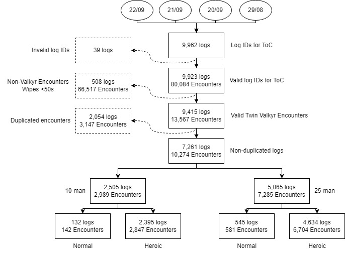

The data used to generate the graphics can be found in this same repository (https://github.com/ForgeGit/TwinValks/blob/main/Twins_ability_data.csv). 

If you want the full data including 10 man/normal modes you can contact me (It was not uploaded mostly due to size constraints.)

## Other analysis and random stuff

- If you have questions, you can contact me on discord: https://discord.gg/wp55kqmyYG (Discord: Discfordge)

- Consider buying me a coffee? :) https://ko-fi.com/forge

- Check other things I have done here: https://github.com/ForgeGit?tab=repositories

